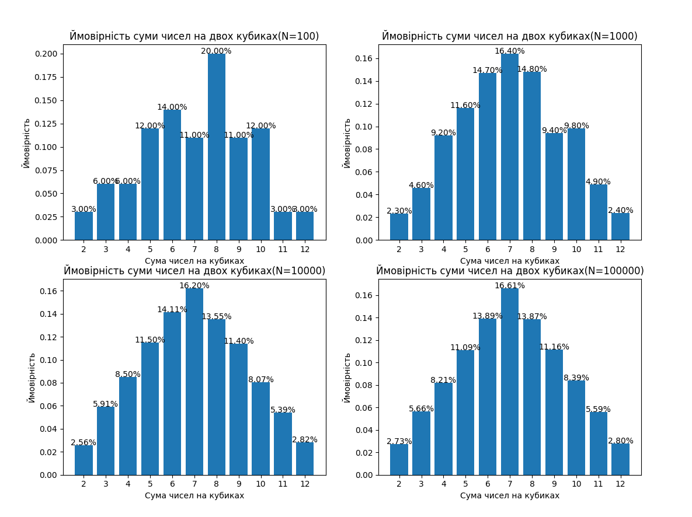

Сума	Імовірність \
2	2.78% (1/36) \
3	5.56% (2/36) \
4	8.33% (3/36) \
5	11.11% (4/36) \
6	13.89% (5/36) \
7	16.67% (6/36) \
8	13.89% (5/36) \
9	11.11% (4/36) \
10	8.33% (3/36) \
11	5.56% (2/36) \
12	2.78% (1/36)

=> Зі збільшенням кількості кидків, результати отримані методом Монте-Карло, більш наближаються до результатів у наведеній таблиці.
